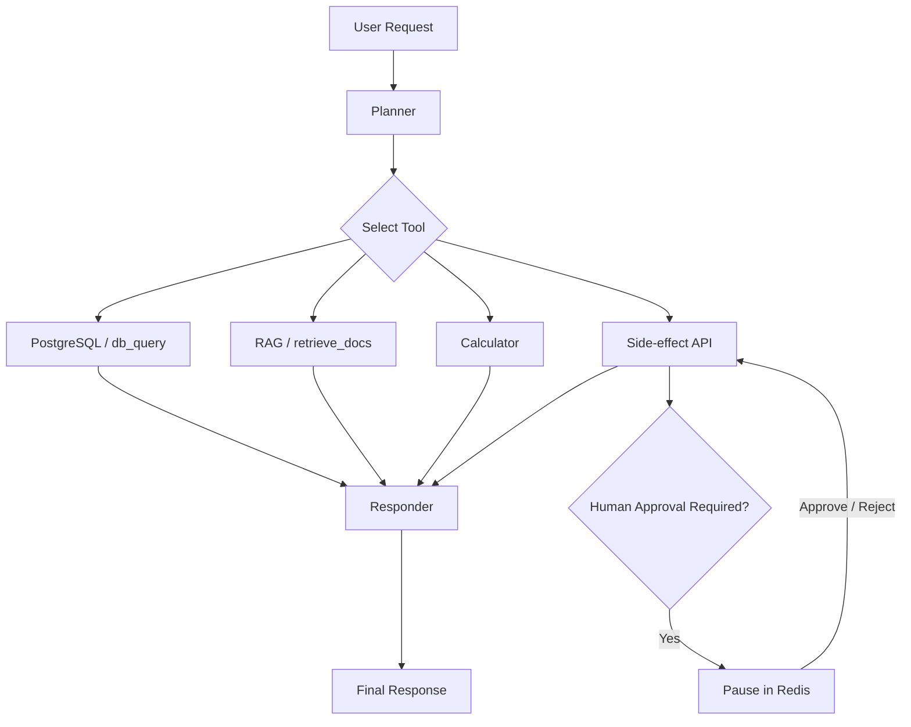

# TaskPilot — Agentic Workflow Automation Assistant

TaskPilot is a Python-based agentic AI assistant that decomposes natural-language requests into multi-step workflows, selects the right tools, preserves short-term conversation state, and pauses sensitive actions for human approval before execution.

It demonstrates practical agent orchestration with **LangGraph**, **LangChain**, **OpenAI / Claude**, **RAG**, **PostgreSQL**, **Redis**, structured outputs, retry handling, and human-in-the-loop controls.

## Highlights

- Multi-step planning and tool selection with LangGraph
- Structured planner outputs validated with Pydantic
- Database lookups for orders, customers, and campaign metrics
- Retrieval-augmented generation for policy and FAQ questions
- Calculator tool for deterministic arithmetic
- Side-effect API actions for refunds, notifications, and campaign budget changes
- Human approval gates before sensitive `call_api` actions
- Redis-backed short-term conversation and paused-workflow state
- PostgreSQL-backed structured data
- Support for OpenAI and Anthropic Claude model providers
- Retry handling for transient/model structured-output failures
- Deterministic 3,000-conversation evaluation benchmark

## Architecture



The planner follows explicit workflow policies. Read-only requests use the appropriate read tool, while side-effect actions such as refunds and campaign budget changes can validate the target first and then pause for approval before execution.

## Tooling

| Tool | Purpose | Example |
|---|---|---|
| `db_query` | Structured database lookups | Order status, customer profile, campaign metrics |
| `retrieve_docs` | RAG over policy/FAQ documents | Refund policy, shipping policy |
| `calculate` | Deterministic arithmetic | Percentages, totals, CTR |
| `call_api` | Side-effect actions | Refunds, notifications, budget updates |
| `respond` | Final synthesis | User-facing answer |

## Human-in-the-Loop Approval

Sensitive actions are not executed immediately. TaskPilot can pause the workflow, save its state, and wait for a reviewer decision.

Example:

```bash
python main.py --conversation demo "Issue a $45 refund for order ORD-1029"
```

Approve it with:

```bash
python main.py --approve demo:2
```

Or reject it:

```bash
python main.py --reject demo:2
```

## Example Requests

```bash
python main.py "What's the status of order ORD-1029?"
```

```bash
python main.py "What is the refund policy?"
```

```bash
python main.py "Calculate 1250 * 0.18"
```

```bash
python main.py --conversation demo "Issue a $45 refund for order ORD-1029"
```

## 3,000-Conversation Evaluation

TaskPilot includes a deterministic synthetic benchmark covering ten workflow categories:

| Category | Cases |
|---|---:|
| Order status | 500 |
| Refund policy | 400 |
| Shipping policy | 300 |
| Arithmetic | 500 |
| Customer lookup | 300 |
| Campaign lookup | 250 |
| Refund action | 300 |
| Notification action | 200 |
| Campaign budget action | 150 |
| Lookup + arithmetic | 100 |
| **Total** | **3,000** |

Final benchmark result:

| Metric | Result |
|---|---:|
| Exact tool-sequence accuracy | **100.00%** |
| Task completion rate | **100.00%** |
| Approval routing accuracy | **100.00%** |
| Response quality score | **100.00%** |
| Execution errors | **0** |

The 100% result applies to this **deterministic 3,000-case synthetic project benchmark**. It should not be interpreted as 100% real-world model accuracy or production reliability.

### What the evaluator measures

- **Exact tool sequence:** whether the planned non-response tools match the expected workflow
- **Task completion:** whether the workflow reaches its completed state
- **Approval routing:** whether approval-required requests correctly pause for review
- **Response quality:** whether required factual result tokens appear in the final response

For safety and repeatability, evaluation-side external action calls are mocked and approval-required benchmark cases are automatically approved by the test harness. The benchmark therefore measures workflow behavior rather than performing real refunds, notifications, or production budget changes.

Generate the benchmark:

```bash
python -m eval.generate_3000
```

Run it:

```bash
python -m eval.run_eval --file eval/test_conversations_3000.jsonl
```

Repair/retry only imperfect saved cases:

```bash
python -m eval.repair_eval
```

## Getting Started

### Prerequisites

- Python 3.10+
- Docker Desktop
- Docker Compose
- An Anthropic API key and/or OpenAI API key

### 1. Clone the repository

```bash
git clone https://github.com/satishvepuri/taskpilot-agentic-ai.git
cd taskpilot-agentic-ai
```

### 2. Install Python dependencies

```bash
pip install -r requirements.txt
```

### 3. Start PostgreSQL and Redis

```bash
docker compose up -d
```

Check the containers:

```bash
docker ps
```

### 4. Configure your model provider

For Claude on Windows Command Prompt:

```cmd
set "TASKPILOT_LLM_PROVIDER=claude"
set "ANTHROPIC_API_KEY=YOUR_KEY_HERE"
```

For OpenAI:

```cmd
set "TASKPILOT_LLM_PROVIDER=openai"
set "OPENAI_API_KEY=YOUR_KEY_HERE"
```

Never commit API keys to Git.

### 5. Run TaskPilot

```bash
python main.py "What's the status of order ORD-1029?"
```

## Project Structure

```text
taskpilot-agentic-ai/
├── data/
├── eval/
│   ├── generate_3000.py
│   ├── repair_eval.py
│   ├── retry_failed.py
│   ├── run_eval.py
│   └── test_conversations_3000.jsonl
├── src/
│   ├── tools/
│   ├── approval.py
│   ├── graph.py
│   ├── llm.py
│   ├── memory.py
│   ├── retry.py
│   └── state.py
├── docker-compose.yml
├── main.py
├── requirements.txt
└── README.md
```

## Design Notes

### Deterministic action policies

The planner uses explicit policies for benchmarked workflows, including:

- refund action → validate order with `db_query`, then `call_api`
- campaign budget update → validate campaign with `db_query`, then `call_api`
- notification action → `call_api` directly unless a lookup is explicitly requested
- policy question → `retrieve_docs`
- lookup + arithmetic → `db_query`, then `calculate`

### Structured outputs and retries

Planner responses are validated against structured models. If a provider returns malformed structured output, TaskPilot retries planning before failing the workflow.

### State and approvals

Redis stores conversation history and paused approval state, allowing a workflow to stop before a sensitive action and resume after an explicit decision.

## Tech Stack

**Python · LangGraph · LangChain · OpenAI API · Anthropic Claude · PostgreSQL · Redis · Docker · Pydantic · RAG**

## Security

- Keep API keys in environment variables or a local `.env` file.
- Never commit secrets.
- Review side-effect actions before approval.
- Use mocked APIs for automated evaluation rather than real production actions.

## Author

**Satish Vepuri**

Built as a portfolio project demonstrating agentic AI orchestration, tool use, RAG, state management, human-in-the-loop workflows, and evaluation.
